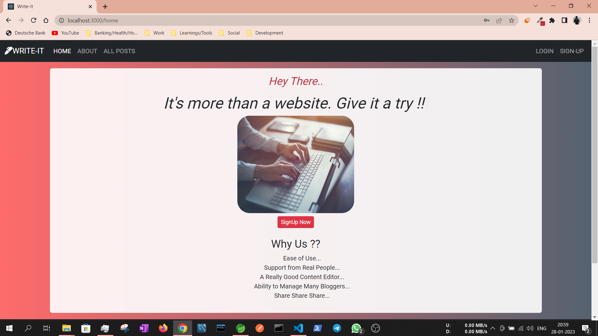

# Write-It Blog Application
Write-It Blog Application is a software program that enables users to easily create and manage blog posts. It is built using React and SpringBoot
 
##### HOME PAGE


##### LOGIN PAGE


##### SIGNUP PAGE


##### ALLPOSTS PAGE


##### FULLPOSTVIEW PAGE


##### ADDPOST PAGE


### QUICK GUIDE/STEPS TO RUN THE PROJECT:
1. Clone the project.
2. Download "STS [ Spring Tool Suite ] IDE and Configure It.
3. Download/Install/Configure Java 17 or above.
4. Download and install "mysql-installer-community-8.0.36.0" [ MySQL Workbench, MySQL command line, MySQL Server ]
5. The Projects needs to have database created as below and rest of the table creation will be taken care by Hibernate itself : 

```
create database writeit;
```
6. Open STS IDE and import the cloned Project [writeit-backend] , Run the project as SpringBoot App.
7. Install NodeJS and Node Package Manager, Move inside [writeit-frontend] folder and open it in vscode and Run npm install , npm start
8. Visit http://localhost:3000/home for home page in your browser.

#### RECENT/ADDITIONAL CHANGES :
* You can now open the Swagger Documentation at : http://localhost:8080/swagger-ui/index.html

Enjoy Write-It Blog Application !! 😊
